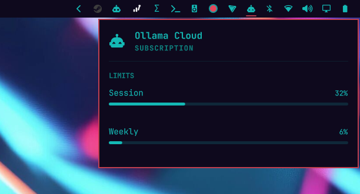

# Ollama Cloud Usage (API)

A fork of [omarchy-ollama-cloud](https://github.com/styles01/omarchy-ollama-cloud)
by [styles01](https://github.com/styles01) (MIT) that swaps the collector:
instead of rendering `ollama.com/settings` through a headless Chromium with
your browser's session cookies, it calls the **official API endpoint**

```
GET https://ollama.com/api/usage
Authorization: Bearer <personal API key>
```

and writes the same display-ready JSON record
(`~/.local/state/omarchy/agents/usage/ollama.json`) that Omarchy's existing
AI toolbar widget already renders. No Chromium, no `--no-sandbox`, no cookie
decryption, no scraping of server-rendered htmx markup — and it works on
systems whose only signed-in browser is something the browser auto-detection
cannot see (e.g. a Brave-Origin profile).

## Install

```sh
omarchy plugin clone https://github.com/LinuxGamerUK/omarchy-ollama-cloud-api
```

(or clone anywhere and copy the folder into `~/.config/omarchy/plugins/`,
then `omarchy plugin validate io.github.linuxgameruk.ollama-cloud-api` and
restart the shell).

## Get an Ollama API key

1. Sign in at <https://ollama.com>, open **Settings → API keys**
   (<https://ollama.com/settings/api>).
2. Create a personal API key.

> **Pick one plugin.** This plugin owns the same `ollama.json` agent record
> as upstream's `omarchy-ollama-cloud`; do not keep both enabled or their
> writers will fight over the record.

The collector reads the key from the first of:

1. `--api-key-file <path>` (or `$OLLAMA_USAGE_KEY_FILE`)
2. `$OLLAMA_CLOUD_API_KEY` environment (set it in `~/.bashrc` or a systemd
   user environment file)
3. `~/.config/ollama-cloud-usage/api-key` — plain file, mode **0600**
4. `~/.dsh/.credentials.yaml` `refs.OLLAMA_CLOUD_API_KEY` (DeepSeek Harness
   users already have this)

```sh
mkdir -p ~/.config/ollama-cloud-usage
printf 'your-key-here\n' > ~/.config/ollama-cloud-usage/api-key
chmod 600 ~/.config/ollama-cloud-usage/api-key
```

The refresh button in the agents panel (`r`) triggers a fetch; otherwise the
service refetches every 15 minutes. On failure the last good usage record is
kept so the chip never goes blank; without a key the panel shows setup help.

### Reset countdowns

The `/api/usage` response carries usage fractions but no reset timestamps —
Ollama only renders those on `ollama.com/settings` (a browser-cookie page).
To show "Resets in …" under each bar, the collector extrapolates from a
one-off seed and keeps correcting itself:

```sh
# read the two reset lines on https://ollama.com/settings, then run:
python3 <plugin-dir>/collect.py --seed-resets session=52m --seed-resets weekly=4d6h
```

- The seed value becomes the anchor; afterwards every anchor advances by its
  window period (5-hour session, 7-day weekly).
- Whenever the usage fraction DROPS between polls the window must have
  rolled, so the anchor is re-pinned from the observation — small seeding
  inaccuracies self-correct over time.
- Without a seed (or with an expired one) the reset lines are omitted rather
  than misleading. Stored anchors live in
  `~/.local/state/omarchy/agents/usage/ollama-resets.json` (usage numbers
  only, no key).

## Uninstall

Remove the plugin folder (and, if you no longer want the Ollama Cloud tab,
run `python3 <plugin-dir>/collect.py --clear` to drop the usage record).

## Privileges and security

- **No privileged actions.** Nothing runs `sudo`/`pkexec`; there is no
  systemd unit provisioning, no `/etc` writes, no system state touched.
- **No runtime code download.** The only subprocess is the bundled Python
  collector. Nothing is cloned, built, or executed from other repositories.
- **Key handling.** The personal API key is never logged, echoed, or placed
  on a command line (process `argv` is world-readable via
  `/proc/<pid>/cmdline` on Linux). urllib injects it directly as the
  `Authorization` header inside the collector process, and **redirects are
  refused** — a 301/302/307/308 from ollama.com fails the request instead
  of forwarding the header to whatever host the `Location` names. The state
  record written to `~/.local/state/` contains usage numbers only, never
  the key.
- **Bounded I/O.** Collector output is capped at the OS pipe level
  (`head -c`), wrapped in process-group-aware `timeout -k 2 N` with a QML
  watchdog fallback, API responses are capped at 256 KiB, parsed model
  collections are bounded, and usage fractions are clamped to `0..1`.

## Credits

- [omarchy-ollama-cloud](https://github.com/styles01/omarchy-ollama-cloud)
  by styles01 (MIT) — plugin structure, state-record schema, and Service.qml
  skeleton.